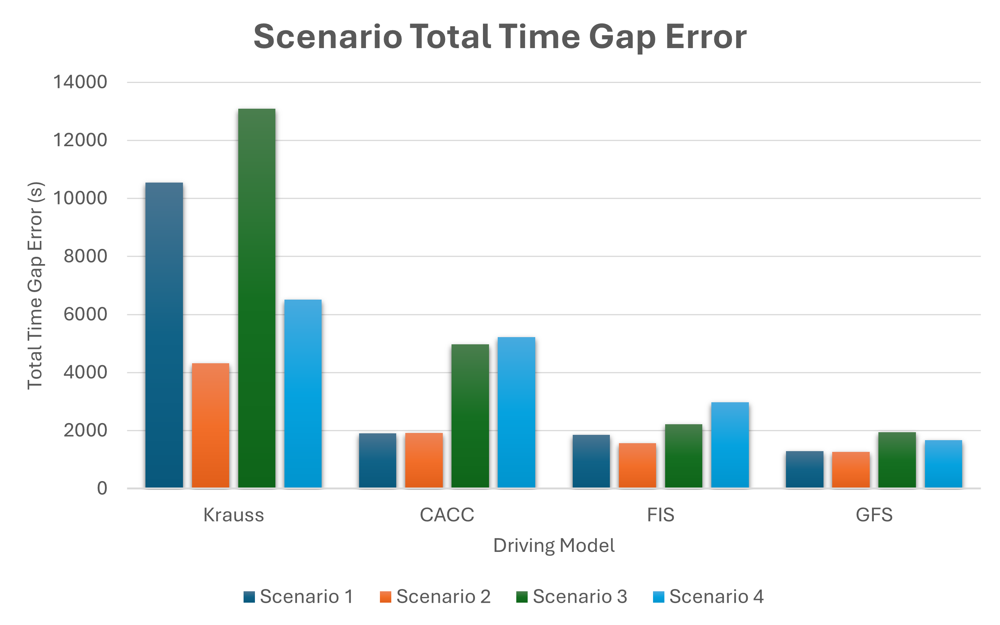
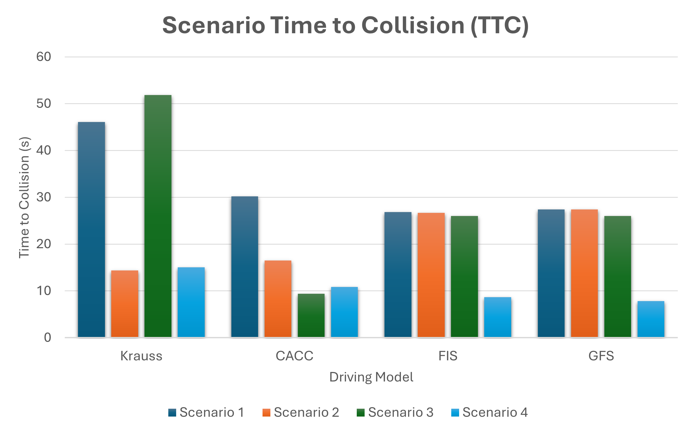

# Optimizing Platoon Time Gap Following using Genetic Fuzzy Systems
This is a record of research work conducted for the completion of a Master's of Science in Aerospace Engineering at the University of Cincinnati.

<!-- Improved compatibility of back to top link: See: https://github.com/othneildrew/Best-README-Template/pull/73 -->

<!--
*** Thanks for checking out the Best-README-Template. If you have a suggestion
*** that would make this better, please fork the repo and create a pull request
*** or simply open an issue with the tag "enhancement".
*** Don't forget to give the project a star!
*** Thanks again! Now go create something AMAZING! :D
-->

<!-- PROJECT SHIELDS -->
<!--
*** I'm using markdown "reference style" links for readability.
*** Reference links are enclosed in brackets [ ] instead of parentheses ( ).
*** See the bottom of this document for the declaration of the reference variables
*** for contributors-url, forks-url, etc. This is an optional, concise syntax you may use.
*** https://www.markdownguide.org/basic-syntax/#reference-style-links
-->
[![Contributors][contributors-shield]][contributors-url]
[![Issues][issues-shield]][issues-url]

<!-- PROJECT LOGO -->
 

    
     
     

<!-- TABLE OF CONTENTS -->

  
Table of Contents

  <ol>
    <li>
      <a href="#about-the-project">About The Project</a>
    </li>
    <li>
      <a href="#getting-started">Getting Started</a>
      <ul>
        <li><a href="#prerequisites">Prerequisites</a></li>
      </ul>
    </li>
    <li><a href="#roadmap">Roadmap</a></li>
  </ol>

<!-- ABOUT THE PROJECT -->
## About The Project

* To build trust, the automated vehicle platooning controllers should adhere to responsible artificial intelligence (AI) concepts like explainability and reliability.​

* Without responsible AI, unexpected failures can upset drivers and lower trust.​

* This research utilizes the soft computing tool Fuzzy Logic to control connected automated vehicles (CAV) that platoon in a simulation.​

* Objective: Reduce the time gap between vehicles and maintain the time gap.​

  * Goal: 0-second time gap error​

* Safety consideration: Time to collision (TTC) above 3-seconds​

  * Relevance: Often used in collision avoidance systems​

* Driving Models: ​

  * Krauss (human-driver)​

  * Cooperative Adaptive Cruise Control (CACC)​

  * Fuzzy Inference System (FIS) – developed during this research​

  * Genetic Fuzzy System (GFS) – developed during this research​

     
    <li>The GFS driving model had a total gap error 32.12% to 68.03% lower than the CACC model.</li>
    
     
     
    <li>All driving models remained above safety-critical TTC (above 3 seconds)</li>
    

(<a href="#readme-top">back to top</a>)

<!-- GETTING STARTED -->
## Getting Started

This is an example of how you may give instructions on setting up your project locally.
To get a local copy up and running follow these simple example steps.

### Prerequisites

This section lists any major modules used during the develop the project.

* Python 3
* skfuzzy
* EasyGA

<!-- ROADMAP -->
## Roadmap

- [x] Add fuzzy logic based platooning vehicle longitudinal control
- [x] Add fuzzy logic based platooning vehicle latitudinal control for lane change decision making
- [x] Train longitudinal controller using a genetic algorithm (GA)
- [x] Train latitudinal controller using a genetic algorithm (GA)
- [x] Compare controllers developed in this research to controllers existing in SUMO traffic simulation software
- [x] Add README
- [ ] Extend latitudinal control to center in lane
- [ ] Extend controllers to handle large platoons

(<a href="#readme-top">back to top</a>)

<!-- MARKDOWN LINKS & IMAGES -->
<!-- https://www.markdownguide.org/basic-syntax/#reference-style-links -->
[contributors-shield]: https://img.shields.io/github/contributors/othneildrew/Best-README-Template.svg?style=for-the-badge
[contributors-url]: https://github.com/HeathPalmer/master_thesis/graphs/contributors
[issues-shield]: https://img.shields.io/github/issues/othneildrew/Best-README-Template.svg?style=for-the-badge
[issues-url]: https://github.com/othneildrew/Best-README-Template/issues
[linkedin-shield]: https://img.shields.io/badge/-LinkedIn-black.svg?style=for-the-badge&logo=linkedin&colorB=555
[linkedin-url]: www.linkedin.com/in/heath-palmer
[product-screenshot]: images/screenshot.png
[google-scholar-shield]: https://img.shields.io/badge/-LinkedIn-black.svg?style=for-the-badge&logo=linkedin&colorB=555
[google-scholar-url]: www.linkedin.com/in/heath-palmer
[product-screenshot]: images/screenshot.png
